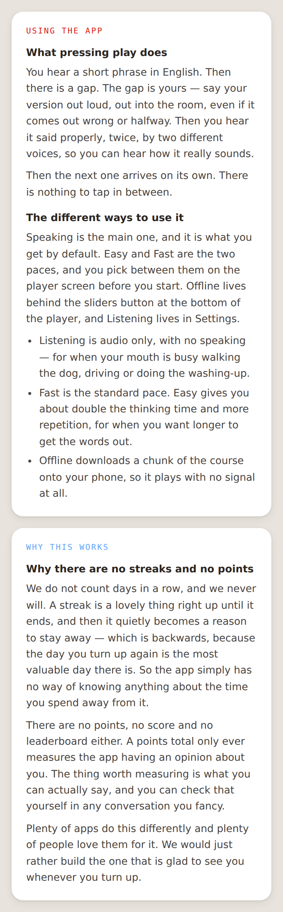
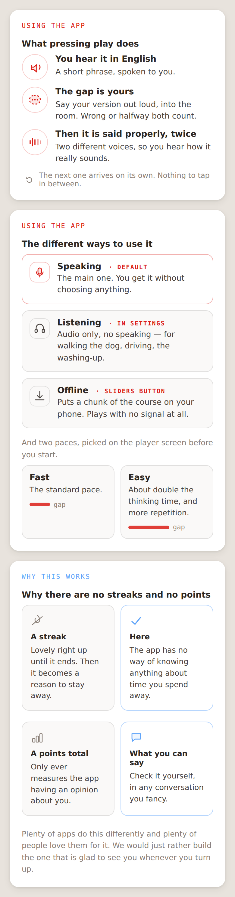
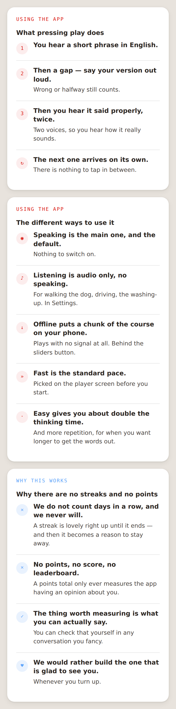
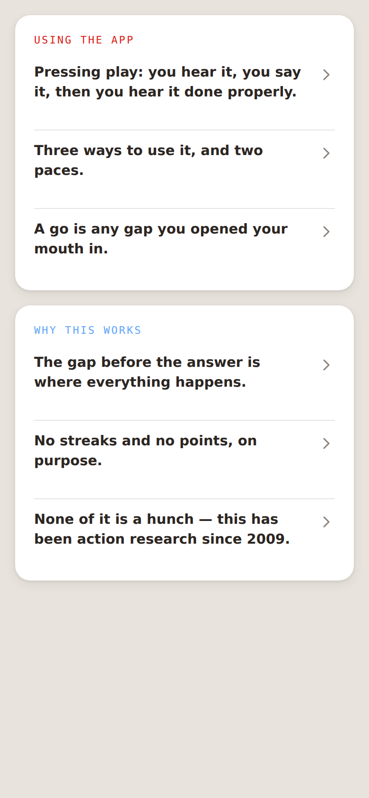
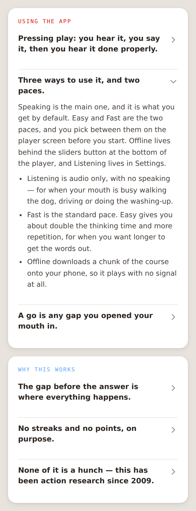
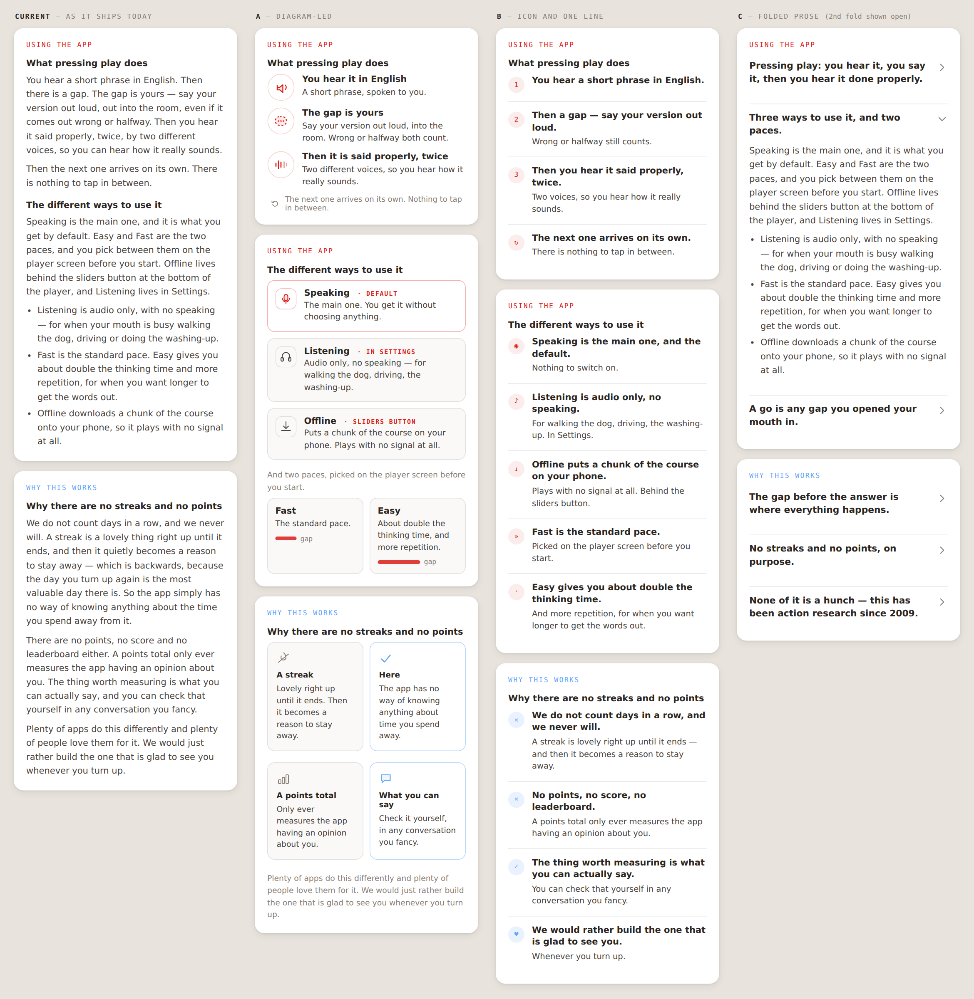

# Explainer visual directions — three mockups

**A-159 · 2026-08-18 · proposals only, nothing wired in.**

You said the How-this-works and Why-this-works prose is working nicely, and you want fewer walls of
text — something more visual and graphical. So this is not a rewrite. Every direction below carries
your words; they only differ in how much of them hit the eye at once.

I took the three heaviest blocks: **What pressing play does**, **The different ways to use it**, and
**Why there are no streaks and no points**. All three directions are drawn in the real Mist tokens —
warm-grey canvas, white elevated cards, the section accent each panel already ships with — with no
new colours invented and no dark mode.

Live mockup file: `docs/a159-explainer-mockups/mockups.html` — self-contained, no build step.

---

## Where we are now

The prose, quoted as it stands:

> **What pressing play does.** You hear a short phrase in English. Then there is a gap. The gap is
> yours — say your version out loud, out into the room, even if it comes out wrong or halfway. Then
> you hear it said properly, twice, by two different voices, so you can hear how it really sounds.
> Then the next one arrives on its own. There is nothing to tap in between.

> **The different ways to use it.** Speaking is the main one, and it is what you get by default. Easy
> and Fast are the two paces, and you pick between them on the player screen before you start.
> Offline lives behind the sliders button at the bottom of the player, and Listening lives in
> Settings. · Listening is audio only, with no speaking… · Fast is the standard pace. Easy gives you
> about double the thinking time… · Offline downloads a chunk of the course onto your phone…

> **Why there are no streaks and no points.** We do not count days in a row, and we never will. A
> streak is a lovely thing right up until it ends, and then it quietly becomes a reason to stay away
> — which is backwards, because the day you turn up again is the most valuable day there is. So the
> app simply has no way of knowing anything about the time you spend away from it. There are no
> points, no score and no leaderboard either… Plenty of apps do this differently and plenty of people
> love them for it. We would just rather build the one that is glad to see you whenever you turn up.

---

## A — Diagram-led

The cycle becomes an actual drawing: hear it, your gap, hear it done properly, and a quiet loop-back
arrow for "the next one arrives on its own". The three ways become three cards with a mark each and
the default one outlined in the section accent. The two paces become two tiles with a gap-length bar
you can literally see is twice as long on Easy. No-streaks becomes a two-by-two: what a streak does
on the left in grey, what we do instead on the right in the section blue.

**Better × Simpler × Cheaper:** best-looking and the only one where the four-phase cycle is actually
*understood* at a glance rather than read — but it costs bespoke SVG per block and a designer's eye
every time a word of that prose changes, which is where the cheaper leg wobbles.

---

## B — Icon and one line

Every paragraph becomes a scannable row: a small mark, a bold one-line claim, at most one supporting
line. Thumb-scroll optimised. The cycle numbers itself 1-2-3 plus a loop mark; the modes and paces
become five equal rows; no-streaks becomes four rows that read ✕ ✕ ✓ ♥.

**Better × Simpler × Cheaper:** genuinely scannable and dirt-cheap to maintain because it is still
just data in the prose file with a mark beside each line — but it *does* rewrite your sentences into
claims, which is the one thing you did not ask for.

---

## C — Folded prose

One strong line per block, tappable to open into the existing prose **verbatim**. Collapsed, the
whole of How-this-works is six lines. Nothing you wrote is cut; the wall is just folded up until
someone wants it.

Collapsed — the whole thing, one screen:

Opened — your prose, untouched:

**Better × Simpler × Cheaper:** deletes the wall without deleting a single word, costs one summary
line per block and one accordion component forever, and it is the same disclosure mechanic the
How-this-works link itself already uses — so it is the cheapest of the three by a distance.

---

## Side by side

---

## Recommendation

**C, with A's cycle diagram dropped inside the first fold** — folding costs nothing and loses none of
your prose, and the one block that genuinely earns a drawing is the four-phase cycle.

One word back: **C**, **C+A**, **A**, or **B**.

---

## Founder rulings I dropped ideas against

- Dropped a "you have done N gos this week" counter beside the cycle diagram — reads as a score, and
  points/score/XP are ruled out.
- Dropped a small calendar heat-grid to illustrate "spread the thirty hours however suits you" — it
  is a days-in-a-row picture by any other name.
- Dropped labelling the diagram's four phases with their real phase names — the language wall means
  the learner never sees internal terminology, so the captions stay as "your gap", "said properly".
- Dropped putting "thirty hours" on a mode/pace card as a headline number — it lives quietly inside
  Why-this-works only.
- Dropped any animation on the cycle diagram; it would be a thing that moves uninvited.
