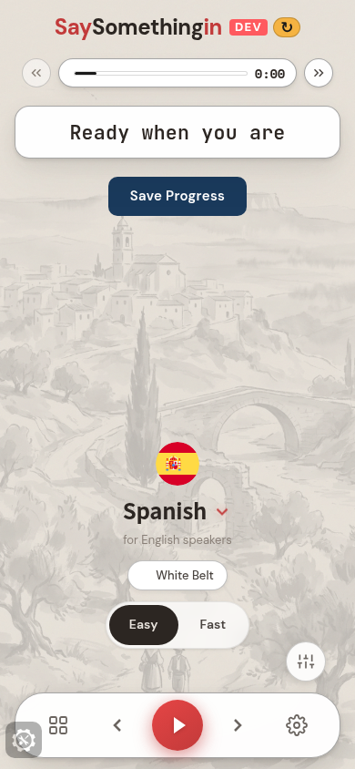
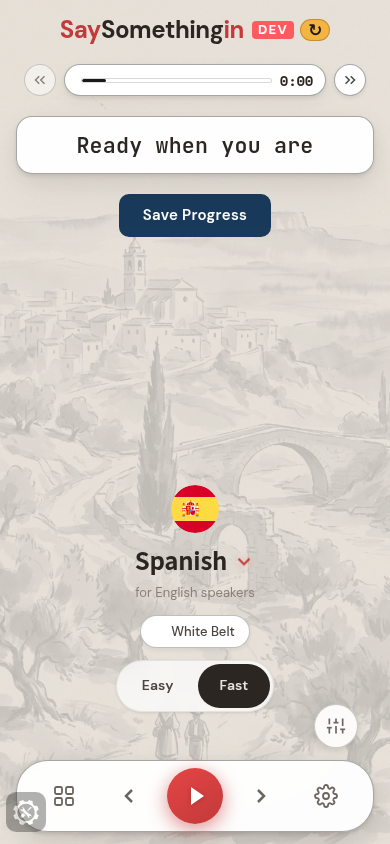

# Easy and Fast — what landed, and the one thing I need your eye on

Aran's ruling, built on the learner app. Two modes now, not three. Turbo is gone.
**Fast is exactly what the app does today** — a rename, not a retune. Easy is the new one.

Landed on **dev** only. Nothing has gone to staging or production, because you said you
want to hear Easy yourself first.

---

## First, the thing you should know

Two agents built this at the same time this afternoon, from the same ruling. Neither knew
about the other. One of them auto-merged itself onto dev around 15:20 — and it had read
your phrase-length line **backwards**. It shipped Easy giving learners the *longest*
phrase available. You asked for the opposite: shorter phrases, not longer.

The other one had already caught that and fixed it, but never merged. So dev has been
carrying the wrong version for the last hour or so. That is now corrected.

There was a second, quieter problem in the merged version, and it is the more serious of
the two. The admin rows you tune from Popty are already live in the database and they name
their settings `scriptShape` and `maxPhraseLengthFraction`. The code on dev was looking for
`script_shape` and `phrase_length_preference`. Different names, so it found nothing:

- Easy was **not** getting its doubled repetitions at all — it silently fell back to the
  normal round shape.
- The phrase-length setting you'd set to 0.5 was being ignored, and the app applied its own
  hardcoded "longest phrase" idea instead.

So Easy on dev was, until now, "slightly longer pauses and *longer* phrases" — close to the
opposite of what you asked for on two of the three counts. Both are fixed and the names now
match what Popty writes.

---

## What Easy actually feels like

Three things, and the honest answer is that they are **not equally strong**.

### 1. More thinking time — this is the one you'll feel

Reading the live settings, Easy gives you **about two extra seconds of silence on every
single gap** before the speaker comes back, and it never lets a gap drop below two seconds
even on the shortest, easiest phrase.

That is the change that will actually land in your ears. On a cycle that today gives you a
beat and a half to answer, you get three and a half. Over a half-hour session that is the
difference between being chased and being waited for.

This one is immediate — flip the switch and the very next gap is longer. No waiting.

### 2. Double the repetitions — real, but arrives later

Every phrase-count knob is doubled: build phrases 7 → 14, consolidation 2 → 4, review
phrases 12 → 24, and the phrases at the first review 3 → 6.

The Fibonacci review *schedule* is deliberately not doubled — that ladder is **when** a
review fires, not how many reps it gives you. Doubling it would have moved your reviews,
not thickened them.

This half lands on the **next** script build — next session, or when you switch course. Not
mid-sentence. Forcing a rebuild in the middle of a round would stall you for several seconds
right when you're trying to speak, which is a worse trade than the reps arriving next time.

### 3. Shorter phrases — **as set, this barely does anything**

This is the one I want to flag honestly rather than let you discover it.

"Half the longest possible phrase" is now built literally: take the longest phrase in the
whole course, halve its length, and drop anything longer. The trouble is that a course's
single longest phrase is a freak outlier, so half of it is *still a long phrase*.

Measured on the real courses:

| Course | Longest phrase | Easy's cap at 0.5 | Phrases it actually removes | Median phrase you meet |
|---|---|---|---|---|
| Spanish | 138 chars | 69 chars | **4.9%** | 31 → 30 chars |
| French | 98 chars | 49 chars | **8.1%** | 26 → 25 chars |

So it trims the very longest tail and leaves the typical phrase untouched. In Spanish, the
longest thing Easy still hands you is:

> "My sister knows people who like watching television in Spanish"
> *Mi hermana conoce personas que les gusta ver la televisión en español*

and the shortest thing it removes is barely longer:

> "I'm definitely doing better than I was last time we talked to each other"
> *Definitivamente lo estoy haciendo mejor que la última vez que hablamos*

If you want Easy to genuinely feel shorter, the number to turn down is that fraction. Here
is what it buys, so you can pick by ear rather than by guess:

| Fraction | Spanish: phrases cut | French: phrases cut | Effect |
|---|---|---|---|
| 0.5 (now) | 5% | 8% | trims the freak tail only |
| 0.35 | 24% | 29% | starts to bite; median drops a little |
| 0.25 | 45% | 54% | roughly halves the typical phrase |

I have **not** changed it. 0.5 is the literal reading of your words and it is what Popty
seeds, so changing it unilaterally would have put the two repos out of step and quietly
overruled you. It is one number in the admin row whenever you want it moved.

**The voice speed is unchanged at normal.** I read "double the time" as your thinking gap,
not slowing the speaker down. Say if you meant the other thing.

---

## Who gets which mode

- **New learners — no play history at all — start on Easy.**
- **Anyone already playing stays on Fast**, exactly as today. Nothing slows down mid-course
  underneath someone who is already going.

That asymmetry is the whole rule, and it is built carefully: the code refuses to decide
anything until it has actually confirmed whether you have history, because "never played"
and "hasn't loaded yet" look identical for the first second, and guessing wrong there would
have dropped an existing learner into Easy mid-course. And if a learner has ever touched the
switch themselves, that choice wins forever, in both directions.

**You flagged this default as yours to overturn and it hasn't been challenged.** It is built
as you ruled it. Say the word if you'd rather new learners start on Fast too.

---

## The switch, and the one open question

One tap flips between the two. Two plain words, no descriptions, no lock icons, no
"beginner" or "advanced", nothing to earn or unlock — a learner who's bored on Easy should
feel invited to tap Fast, not like they're claiming an achievement.

**Placement is the open question, and it's the thing I'd like your eye on.**

It currently sits on the **player's resting screen** — the screen you land on before you
press play, near the belt badge. The reasoning: Easy vs Fast is a decision you make *before*
you start, not a dial you hunt for mid-sentence, and that screen is where the other
"where am I, which course" furniture lives. It is also the closest honest reading of Aran's
"front page".

You floated the bottom nav. I did not put it there, and I took the old Turbo entry *out* of
that tray while I was in it — the tray is for things you flip during a session, and burying
a before-you-start choice one tap deep behind a sliders icon is exactly where Turbo went to
die and where almost nobody found it.

But it is a small move if you'd rather it sat elsewhere.

Here it is on a phone, both states — Easy selected, then Fast after one tap. This is the
live dev build, not a mockup:

If the images don't load for you, they're also here:
https://watson-1.tail4968cb.ts.net/d/ab591529

Verified live on the dev build: the control shows up, one tap flips it either way, the
selected side is a solid dark pill, the tap target measures exactly 44px, and the choice
survives a reload. One honest gap — the probe ran in a browser only, so it confirmed the
choice saves to the device but could **not** confirm it saves to your learner record for
cross-device. The code writes both; only the device half is proven.

Worth noticing in the screenshot: it opens on **Easy**. That is the new-learner default
doing its job — a fresh browser has no play history, so it lands on Easy. Your own account,
which has history, will open on Fast until you tap.

---

## Where it is

On **dev** only, live at the dev alias. **Not** on staging, **not** in production — waiting
on your listen.

One gap worth naming: the **Popty admin side is also unmerged**. The tuning rows themselves
are already live in the shared database, which is why Easy works and why the numbers above
are real — but the admin *screen* for editing them from Popty is still sitting on its own
branch. Every number above can be changed in the database today; the pretty editor for them
needs that branch landed.
