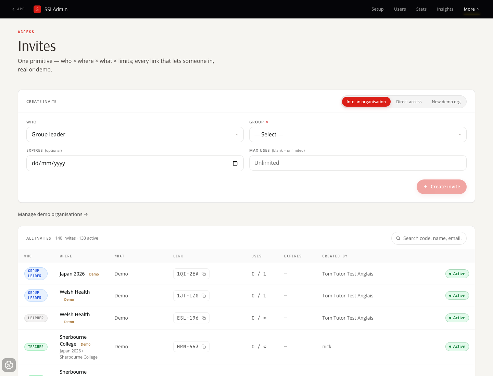
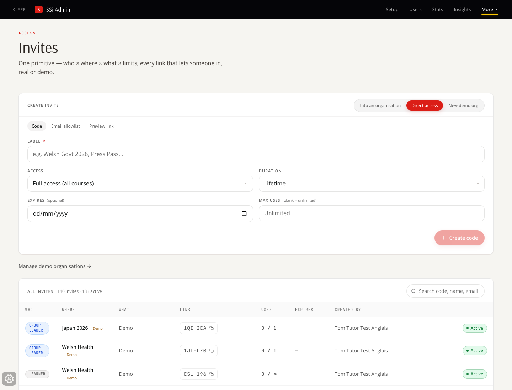
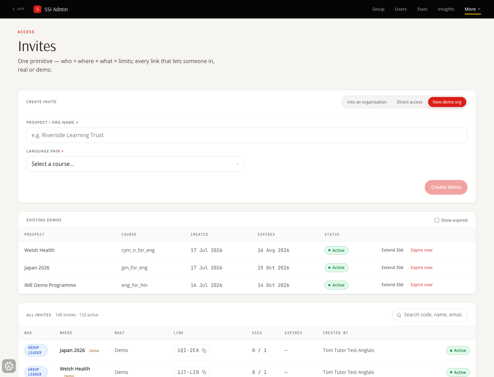
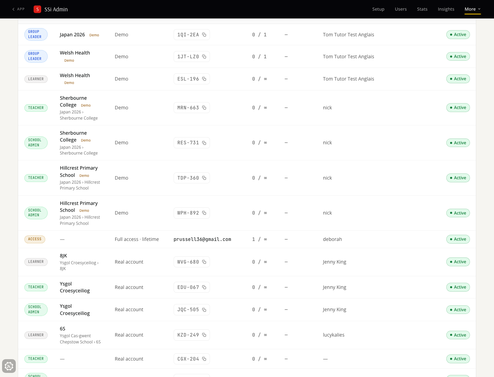
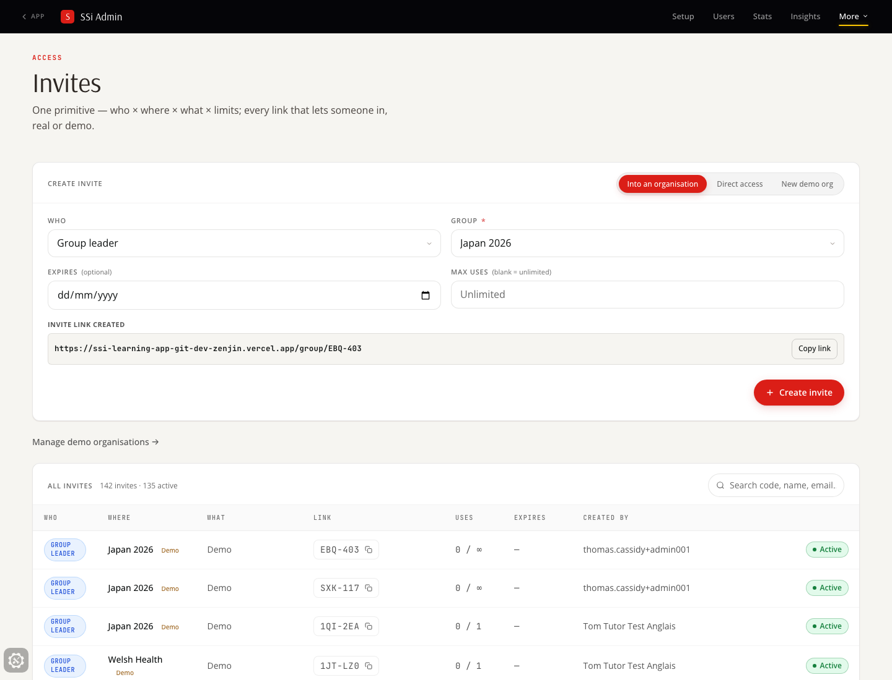
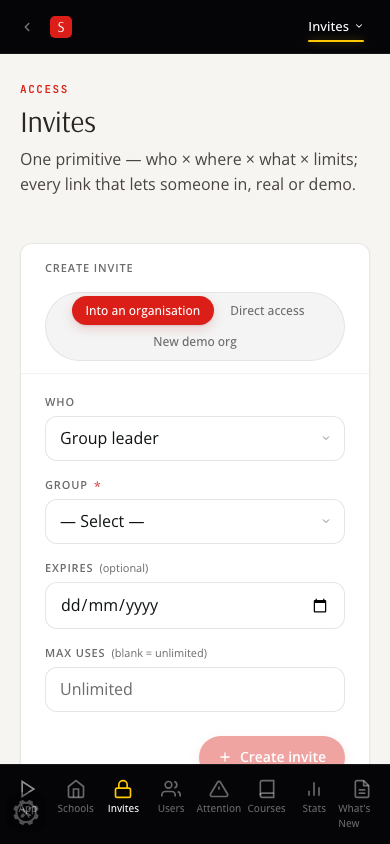
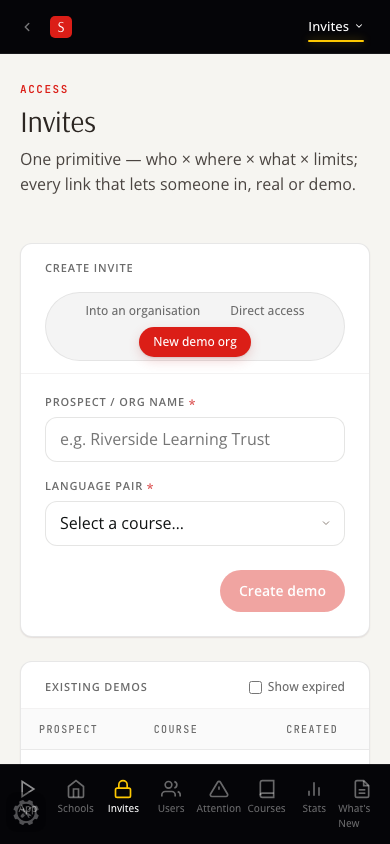

# Invites — verification shots (deployed dev build)

Captured 2026-07-17 against `https://ssi-learning-app-git-dev-zenjin.vercel.app/admin/invites`
with a real ssi_admin session (harness: `packages/player-vue/e2e/invites-redesign/`).
Design rationale: [DESIGN.md](./DESIGN.md).

| Shot | What it shows |
|---|---|
|  | Default mode — invite into the org tree: who × where × limits, unified list below |
|  | Direct access — code / email allowlist / preview link as sub-variants of one form |
|  | Demo preset — still two fields (Nick's flow), existing demos managed on the same page |
|  | The one list — real and demo, every source, uses/expiry/creator/active in one place |
|  | Live-minted leader invite (created through the deployed UI, then deactivated) |
|  | Mobile — create card stacks, Invites in the bottom nav |
|  | Mobile — demo preset |

Verified live on the deployment: all three retired routes redirect in
(`/admin/access → ?mode=direct`, `/admin/demos → ?mode=demo`,
`/admin/try-links → ?mode=direct&sub=preview`); a leader invite was minted
through the UI, appeared in the unified list with the right who/where/what,
and was deactivated via the list's toggle. Existing codes were untouched —
the list is a read-side lens over the four existing tables.
