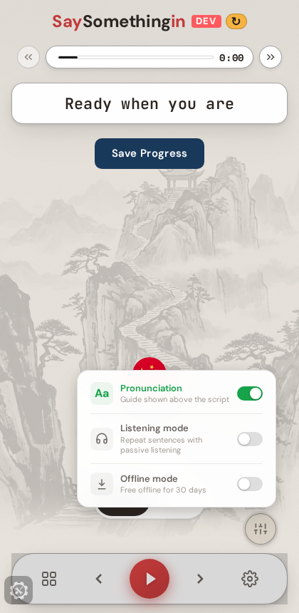
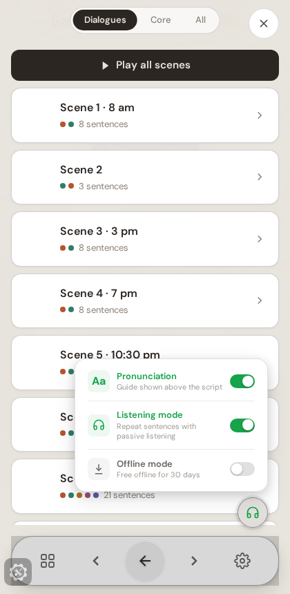

# Listening mode: back to a one-tap round trip

**Tom's ruling, 2026-08-06.** "I don't actually want the listening mode to disappear
from the… It was a misunderstanding between Aran and me. I want it to exist there
because it needs to be. The sort of thing that you can move backwards and forwards
from quite easily."

Verified on the live dev build (`ssi-learning-app-git-dev-zenjin.vercel.app`),
phone viewport, a learner who has never opened developer settings.

> **Superseded in part (2026-08-07).** The toggle and its UI are unchanged, but
> what the toggle turns ON is now one simplified listening mode: every phrase
> plays target · known · target · target, all four clips at one speed, ramped
> over exposures and never above 1.0. The nine-stage ladder is retired. See
> `docs/cold-start-and-playback.md` and `apml/learning/listening-layers.apml`.

## What it looks like now

Listening mode sits in the mode tray between Pronunciation and Offline, as a plain
on/off row with exactly the same shape as its neighbours.

One tap and the listening overlay is up. Reopen the tray and the row reads ON —
tap it again and you are back in the player. The transport's back arrow is the
other way out and is unchanged.

## The thing that was NOT restored

The old "Mode — pick one" radio group — HISE versus Listening — is gone for good.
That mode-picking ceremony is what Aran called distracting on 2026-08-06, and his
objection stands on its own terms. What replaced it is a switch, not a choice:
no new UI concept, no framing that asks the learner to declare a mode.

## Three calls I made

1. **A toggle row, not the radio group.** It gives Tom the easy back-and-forth and
   drops the framing Aran objected to. Both readings satisfied, one control.
2. **The row is not hidden behind the developer flag.** `ssi-mode-listening`
   defaults to off, so gating on it would have hidden the control from every real
   learner while looking finished in code. The row is ungated, which is also what
   it was before this morning.
3. **Settings keeps its Listening mode row** as a second, discoverable route. It
   costs nothing and cannot disagree with the tray — both read the one overlay flag.

## Copy fix found on the way

The tray row uses `settings.listeningMode` / `settings.listeningModeDesc`, not the
`modes.listening` pair the old tray used. The settings keys are translated in all
22 locales; the modes keys exist only in English and Irish, so 20 languages would
have shown English words in the tray. Both routes now read identically in every
language.

## What was checked

Thirteen assertions against the deployed dev build, all passing: the row is present
with no dev flag set, it is a toggle rather than a radio, one tap opens the overlay
and closes the tray, reopening shows the toggle ON, the same row exits, Settings
still carries its row, and no page errors. The probe lives at
`packages/player-vue/e2e/listening-quick-toggle-probe.mjs`.

**Gap, reported honestly:** none of this could be driven against a local dev server.
That environment has no Supabase credentials, so no course loads and the player
component never mounts — the mode tray renders but has nothing to toggle. Every
verification above is against the deployed dev build, which is the artefact Tom
tests anyway. Playwright's chromium was also missing `libnss3` / `libnspr4` on this
host; that was fixed by extracting the Ubuntu packages to `/tmp/nsslibs` and setting
`LD_LIBRARY_PATH`, so browser probes do work here now.

**Not promoted.** The Friday release train is on Tom's hold. This is on `dev` only.
