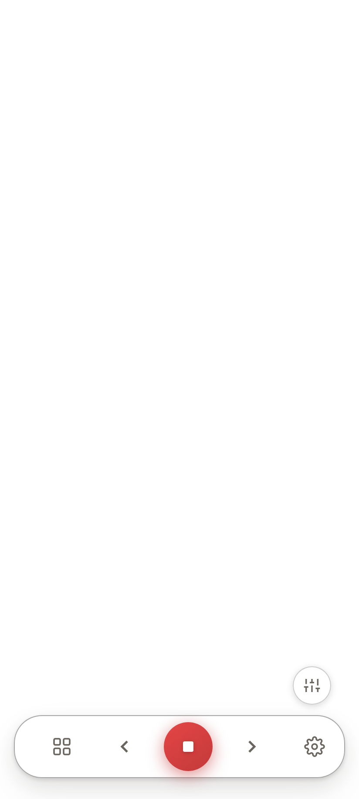
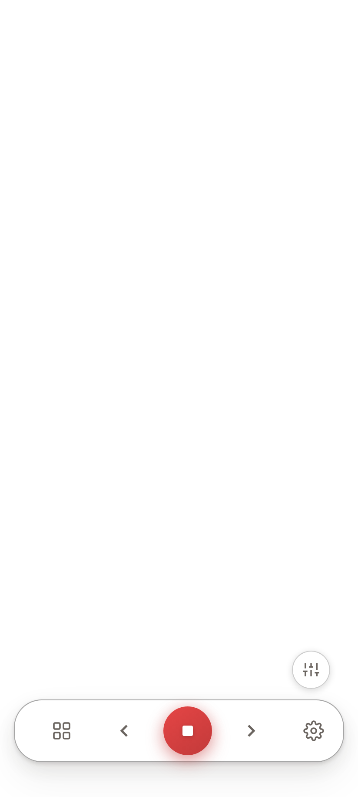
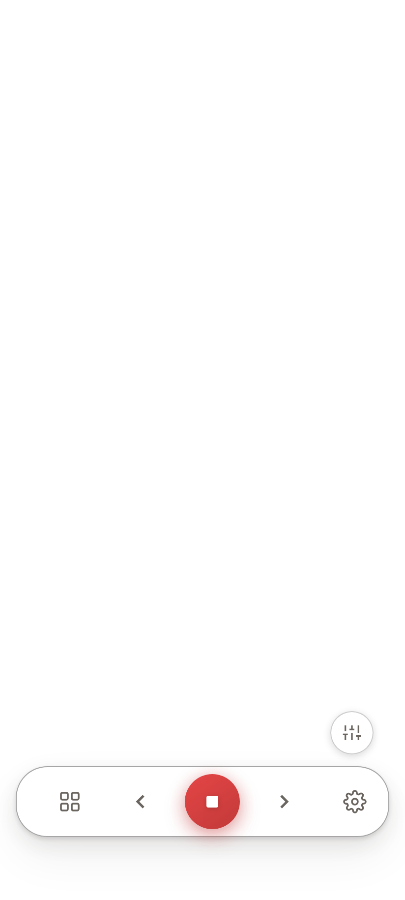

# Android: the bottom controls now clear the phone's navigation bar

**2026-09-05, job #582.** Deborah's one complaint about the 4 September build, closed —
plus the honest limit on how far it could be proved from this machine.

---

## Install

**https://popty.app/builds** — the top entry, "SSi Android wrapper — bottom controls
clear the nav bar (5 Sep 13:42)". Sign in with the usual Popty login.

`ssi-devwrap-5e991962-debug.apk` · 23,342,884 bytes ·
sha256 `1321ef95e873121833a82c333713f09f5630be799dbe48cb5576c9096a56f13a`
(verified against the bytes downloaded back out of the bucket).

**Only installing this APK carries the fix to a phone.** The web assets are bundled
inside it; no merge, no reload and no "Tap to update" can bring new web code into an
installed build.

---

## What she said, and what was actually wrong

> "I do not like that the bottom controls are so close to my phone controls."

The bottom pill row anchored itself at `max(inset / 2, 12px)` — the iOS convention,
where the home indicator is inert and half an inset is what native apps do. Android's
navigation bar is not inert: it is a live control surface under both gesture and
three-button navigation. Half an inset puts the row **inside** it.

That is not a guess. The probe below includes a negative control that re-runs the same
assertions against the old rule:

> **Old rule, three-button navigation (48px inset): the row's bottom edge sat 24px
> INSIDE the navigation bar.**

Under the wrapper's other posture — where it pads the WebView out of the system bars and
reports a zero inset — the old rule left a bare 12px gap instead. Both readings are her
complaint, and both are fixed by the same change.

---

## The fix — one token, not a per-screen patch

`--shell-nav-clearance`, defined once in `packages/player-vue/src/styles/design-tokens.css`,
is now the single definition every bottom-anchored piece of chrome derives from. `BottomNav`,
`--nav-total` (which every element floating above the row reads) and `.course-identity` read
it; none of them writes `env()` any more.

| Shell | Rule | Change |
|---|---|---|
| Web, installed PWA | `max(inset / 2, 12px)` | **none — unchanged** |
| iOS shell | `max(inset / 2, 12px)` | **none — unchanged** |
| Android native shell | `max(inset + 16px, floor)` | full inset + 16px touch margin |

**No hardcoded height, anywhere.** Gesture navigation and three-button navigation report
different insets on the same handset, so the rule reads `--shell-inset-bottom`, which is
`var(--safe-area-inset-bottom, env(safe-area-inset-bottom, 0px))` — preferring the
properties the wrapper's SystemBars plugin sets, which is the only source correct in
*both* of its postures, and falling back to native `env()` everywhere else.

### The zero-inset trap, and the floor

A measured inset of zero means one of two opposite things:

- **Legitimate:** the wrapper has padded the WebView out of the system bars, so the chrome
  is already clear of them and a small floor is all it needs.
- **The failure mode:** nothing is measuring, the window is edge-to-edge, and the controls
  are sitting inside the navigation bar — which looks *exactly* like the fix not being there.

`packages/player-vue/src/platform/shellSafeArea.ts` resolves that by asking whether any
source is reporting at all, not what it reads: **24px** floor when one is, **64px**
(48dp three-button bar + 16px margin) when none is. The floor is a safety net; wherever
the real inset is larger, the real inset wins.

It also re-settles on `resize` and `orientationchange`, because Android insets are dynamic —
they change with rotation, a navigation-mode switch and the keyboard. They are not the iOS
mechanism, which is painted from the root background and set at launch.

### Making the inset real, and visible

- `capacitor.config.ts` now **declares** `plugins.SystemBars.insetsHandling: 'css'` rather
  than inheriting the default. Confirmed present in the APK's own
  `assets/capacitor.config.json`.
- The Settings build card carries a new quiet third line: **`insets t/r/b/l · source`**.
  Native shell only. If its bottom number is `0` and the source reads `none`, the phone is
  not reporting insets and the conservative floor is what is holding the controls clear.
  Not gated behind `?debug` — a WebView has no address bar, so a query flag would make it
  unreachable on the exact device it exists for.
- The top inset was checked in the same pass: `--safe-area-top` now routes through
  `--shell-inset-top` on the same preference chain.

---

## Proof — hit-test, never screenshot

`packages/player-vue/e2e/_android-clearance-harness/probe.mjs` mounts the **real**
`BottomNav` with the **real** design tokens and, at three simulated insets, asserts that
`document.elementFromPoint` at each control's own centre returns that control (not an
overlay), and that every control's bottom edge clears the simulated system-bar line by at
least the 16px touch margin.

A control that photographs perfectly can still have zero tappable pixels — this estate has
already shipped one.

| Simulated inset | Row clears the bar by | grid | previous | PLAY | next | settings | modes |
|---|---|---|---|---|---|---|---|
| **0px** (padded WebView) | 24px | 34px ✓ | 34px ✓ | 32px ✓ | 34px ✓ | 34px ✓ | 108px ✓ |
| **24px** (gesture nav) | 16px | 26px ✓ | 26px ✓ | 24px ✓ | 26px ✓ | 26px ✓ | 100px ✓ |
| **48px** (three-button nav) | 16px | 26px ✓ | 26px ✓ | 24px ✓ | 26px ✓ | 26px ✓ | 100px ✓ |

✓ = `elementFromPoint` at the control's centre returned that control.

Two controls: **web/iOS rule at a 48px inset → 24px up, unchanged** (the fix did not move
iOS). **Negative control, old rule at a 48px inset → 24px INSIDE the bar**, so the probe
fails on the bug and passes on the fix. A hit-test only ever seen green proves nothing.

The injection is honest: the probe sets `--safe-area-inset-bottom`, which is the exact
property the wrapper sets on a real device, and the layout consumes it through the token's
own definition. What it cannot verify is that the wrapper sets it at all on Deborah's
handset — that is what the Settings read-out is for.

---

## THE GAP — no device screenshots from this machine

**This box cannot run an Android emulator.** `/dev/kvm` does not exist on watson-1: no
hardware virtualisation, no AVD, no system image. The wrapper job of 4 September recorded
the same finding. The Pixel emulator Tom used is on **his** machine, not this one.

So the acceptance condition as written — real screenshots at both navigation settings on a
real Android surface — **was not met by me, and is not claimed.** What is above is a
deterministic hit-test in Chromium (the same engine the Android System WebView is) plus a
runtime read-out that makes the one thing the hit-test cannot see visible on the handset
itself. The device evidence has to come from a phone: Deborah's, or Tom's emulator.

---

## Gates

All green on `cs/582-android-bottom-controls-must-cle`:

- `@ssi/core` build → clean
- player-vue typecheck → clean
- player-vue lint → 0 errors (168 pre-existing warnings, unchanged)
- player-vue vitest → 310 files passed, 1 skipped; 3113 passed, 3 skipped, 3 todo
- the clearance probe → 0 failures

`platformDoors.test.ts` is inside that suite and passes: the shell question is asked in one
place, and the Settings card renders a string it is handed rather than asking what platform
it is on.
