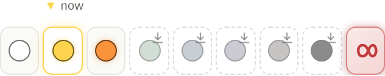
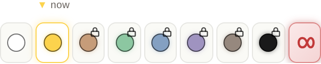

# Belt strip: the padlock means entitlement — verification, 2026-09-04

Hit-tested, not eyeballed: a padlock on the wrong chip and a padlock on the right
chip look identical on a nine-chip strip. The probe
(`packages/player-vue/e2e/_beltstrip-harness/probe.mjs`) mounts the real
`ProgressModal` with the real stylesheet in headless Chromium at a 390×844 phone
viewport, reads every chip's DOM and computed style, and asserts which chip
carries which glyph before it takes the picture.

## Needs paying for — a guest on a premium course

Free through the end of Yellow, so Orange…Black wear the padlock. Full colour,
full opacity, still tappable: this is a live offer, not murk. The tap runs the
same `handleSkipToBelt` → `gateSeed` path that already raises the paywall when a
learner plays into seed 20.

## Still downloading — three redundant channels, no padlock

Dashed outline, no fill, dim, plus a download arrow. Dim alone read as murk
on-device (Tom, 2026-07-09), which is what put a padlock here in the first place.
Every one of these chips stays tappable and lands as soon as the content arrives.

## Unpaid AND undownloaded — money wins

Green…Black are both here. They wear the padlock, not the arrow: the download
resolves itself and the payment will not.

## What was asserted

Per chip, in all three states: which chips carry `.map-chip-lock`, which carry
`.map-chip-dl`, which carry the `is-offline` waiting class, that NO chip is
disabled, and — for the waiting chips — computed `border-style: dashed`,
`background-color: rgba(0,0,0,0)` and `opacity < 1`. Plus: a padlocked chip is
not disabled and its click emits the jump. Raw results: `hit-test.json`.

Also green: `player-vue typecheck`, `networkGate.test.ts` (9), 
`ProgressModal.offlineNotice.test.ts` (12), the i18n gate, `player-vue lint`
(0 errors), and a full production `player-vue build`.
