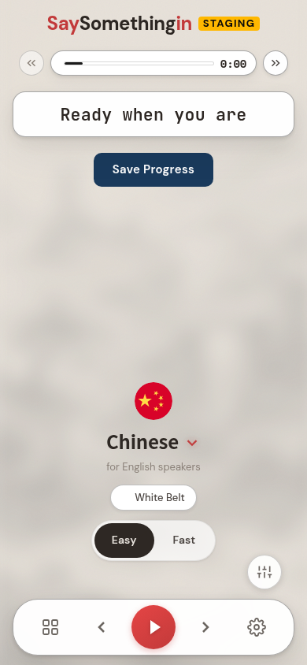
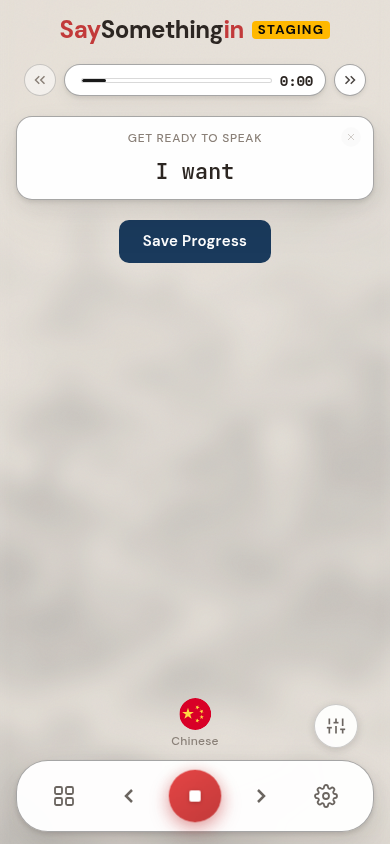

# The cold-start readiness lie — measured on staging, 8 August 2026

Tom, on staging this morning right after clearing his cache:

> "first play after a clear of a cache is a bit misleading — the play button appears
> ready, it stops flashing while loading, but when you actually press play it still
> takes a few seconds to play. And also, if you wanted to change belt position or do
> anything else, none of that functionality is ready just yet. So it LOOKS like the
> app is unresponsive for a few seconds."

**It reproduces, and it is worse than "unresponsive".** On a realistic mobile
connection the app stops flashing, invites the tap, and then tells the learner
**"GET READY TO SPEAK — I want"** while playing absolutely nothing for **7.2 seconds.**

This is diagnosis only. No fix has been built.

---

## The picture

The moment the button stops flashing — this reads as ready:



A third of a second after the tap, and for the next seven seconds — silent, no
loading message, prompting the learner to speak a phrase they have not heard:



---

## The numbers

Every run started from a genuinely empty browser: a throwaway browser profile per
run, so no service worker, no HTTP cache, no IndexedDB audio cache and no saved
login carried over. Emptiness was verified in-page on every run, not assumed
(`swCount: 0, dbs: [], localStorageKeys: 0`). Signed out, brand-new learner,
phone-sized screen. Course served was Chinese for English speakers.

"Audible" means a media element actually reported its playhead moving past zero —
not that a `play()` call returned.

| Connection | Button stops flashing at | Tap → first sound | Runs |
|---|---|---|---|
| Unthrottled, fast desktop | 8.3 s | **0.31 s** | 4 |
| 4 Mbps / 80 ms | 6.0 s | **0.27 s** | 3 |
| Fast 3G — 1.6 Mbps / 150 ms | 7.5 s | **7.2 s** (spread 6.1 – 7.3) | 5 |

The spread is tight within each condition — this is not noise.

**The decisive test.** On Fast 3G, wait ten seconds after the button says ready
and then tap: sound starts in **0.27 s** (two runs, 271 ms and 268 ms). The work
does finish. The button simply announces readiness about seven seconds before it
arrives. An honest signal was available all along.

**Other controls, same connection:** tapping the belt pill at the moment it looks
ready takes **1.35 seconds** to put the belt screen on the screen (1351 ms and
1368 ms). A tap that appears to do nothing for a second and a third.

---

## Answering the four questions

### 1. What the flashing is bound to, and what is still outstanding

The flashing play button is the round red button in the bottom bar. It carries a
`is-disabled` class while the app is loading, and that class is what runs a
1.8-second pulse animation (`BottomNav.vue:431`). The class is driven by
`isPlayDisabled` (`BottomNav.vue:108`), which is driven by a single prop,
`isPlayerReady`, defined in one place:

```
isPlayerReady = !isAwakening          PlayerContainer.vue:115
isAwakening   = loadingStage !== 'ready'   LearningPlayer.vue:5952
```

So the flashing stops at exactly one instant: when `loadingStage` flips to
`'ready'` (`LearningPlayer.vue:5951`, flipped at `13787`).

What has been awaited by that instant: the course row, the learner's progress and
belt position, the learning script, and the rounds built into the player. Also a
deliberate cosmetic floor — 2.8 seconds of splash animation for a first-time
visitor, 300 ms for a returner (`LearningPlayer.vue:12012`). Both the data load
and the animation floor are awaited together at `13773`.

**What has NOT been awaited is the audio.** Three lines above the flip:

```js
// Warm the first known audio into the SW cache, but DO NOT await it — blocking
// 'ready' on this fetch cost ~600ms on cold-cache loads (measured). Fire it in
// the background and go ready immediately; if the learner taps play before it's
// warm, the head-miss path streams the first clip.
void warmFirstKnownAudio()        LearningPlayer.vue:13785
await goLoadingStageReady()       LearningPlayer.vue:13787
```

That is the trade-off, taken consciously and written down: shave ~600 ms off the
splash, accept a "head-miss" if the learner taps early. On a desktop connection
the bet pays — the head-miss costs 0.3 s. On Fast 3G the same bet costs 7.2 s,
because the outstanding resource is not a 600 ms fetch, it is a **68 KB audio
file over a 1.6 Mbps link, requested at the ready moment alongside seven sibling
audio fetches.**

The evidence that this is the outstanding resource, and not the script or config
or auth:

- **Zero audio requests are issued before the button says ready.** Measured:
  `audioRequestsBeforeReady: 0`. The first audio request leaves the browser
  384 ms *after* ready.
- The clip that eventually sounds is the same file in every run
  (`/api/audio/02f6c89d-…`, 67,968 bytes). Its response headers arrive at
  ready + 0.4 s; its bytes complete at ready + 7.5 s.
- The `play()` call happens 211 ms after the tap — instantly. The silence is
  entirely the bytes not being there.
- Nothing else is outstanding: the round preloader that used to fetch audio here
  has been a deliberate no-op since May (`LearningPlayer.vue:5444`), so the
  `await` on it in the play handler (`7671`) costs nothing.

**It is the network, not a jammed main thread.** The whole-course background walk
is deliberately released at this same instant (`resolvePlayerReady()`,
`LearningPlayer.vue:13790`), and it used to run as one 12–13 second main-thread
task. Running the existing `e2e/post-ready-interactivity-probe.mjs` against
staging with a 4× CPU throttle: the largest single main-thread task after ready is
**104 ms**, and a tap dispatched at the ready paint is processed in **15–19 ms**.
The cooperative slicing that was put in for that problem is holding. So the seven
seconds is bytes on the wire, not a frozen thread.

What I still have not isolated: at 1.6 Mbps a 68 KB file on its own should arrive
in well under a second, so most of the 7.2 s must be **contention** with the seven
sibling audio fetches and the remaining app assets. That is the strong inference,
but I did not prove it by serialising the first clip and re-measuring.

### 2. Why the other controls are dead too

They are **not** on a separate signal. The belt badge and the Easy/Fast switch are
gated on the very same `isPlayerReady` (`PlayerRestingState.vue:95` and `:104`),
and they appeared at *exactly* the same millisecond as the button stopped flashing
in **every single run** — a measured gap of 0 ms, 16 times out of 16. There is one
readiness flag in the app, and everything visible hangs off it.

What is dead is dead for two different reasons:

| Control | Behaviour in the window | Why |
|---|---|---|
| Play button | Flashes, then stops flashing ~7 s before it can make a sound | The audio is not fetched until the flip |
| Belt badge | Not rendered at all until ready | `v-if="isPlayerReady"` |
| Easy / Fast switch | Not rendered at all until ready | `v-if="isPlayerReady"` |
| Belt pill (jump to a belt) | Visible and tappable from ~0.8 s, but a tap does nothing visible for 1.35 s even at the ready moment | The screen it opens is `v-if="contribution.data.value"` (`LearningPlayer.vue:14518`) and that fetch is *deliberately scheduled to begin only after ready* (`:12050`) |
| Belt step ‹‹ / ›› | Visible from ~0.8 s; back is correctly disabled at position zero | Header chrome renders before the player has anything to step |
| Course name (switch course) | Visible and tappable from ~0.8 s | Renders on the course row alone, by design |

So Tom's "belt position isn't ready" has a specific and rather exact cause of its
own: the belt screen refuses to render until its data has arrived, and the app
deliberately does not *start* fetching that data until after it has told you it is
ready — the comment says so, and the reason is sound (it is display-only, so it
was pushed off the critical path so as not to compete for bandwidth). The pill is
never disabled and never acknowledges the tap, so on Fast 3G it is a silent no-op
by construction. A second, smaller lie sitting on top of the first.

The two hidden controls are the honest ones — they simply do not appear. The
damaging ones are the controls that are drawn, look live, and are not.

### 3. How long the window really is

Measured, above. In one sentence: **on a realistic mobile connection the app claims
readiness about seven seconds early, and the belt screen about one and a third
seconds early.** On a fast connection the same claim is early by a third of a
second, which is why this has survived — it is invisible on the machines it gets
tested on.

Worth setting against the spec: `apml/playback/lazy-loading.apml` states the goal
as *first play in under 2 seconds*. Measured cold on Fast 3G, first play from the
tap is **7.2 seconds**, and from opening the app **15 seconds**. That gap between
the stated promise and the cold-cache reality is itself a finding.

### 4. Is there one honest readiness signal?

**No. Readiness genuinely arrives in stages, and the interface currently pretends
to a single moment.** The stages, as measured:

1. **~0.8 s — the shell.** Course name, flag, belt pill, step chevrons and
   settings are on screen. Nothing is playable and the belt screen is not loaded.
2. **~7.5 s — the lesson exists.** Script built, rounds in memory, belt and
   progress known. *This is the moment everything currently flips.* Nothing can
   be heard yet.
3. **~ready + 7.5 s on Fast 3G (~ready + 0.3 s on desktop) — the first sound is
   in hand.** Network-dependent and, importantly, **unbounded** — there is no
   ceiling on how late this stage can be.
4. **~ready + 1.35 s on Fast 3G — the belt screen is loadable.**

Stage 3 cannot be folded into stage 2 without reintroducing exactly the delay that
was deliberately removed. So the honest answer is the one the brief anticipated:
the interface should tell the truth about a staged arrival rather than pretend to
a single moment.

---

## What to do — three shapes, one recommendation

**A. Hold the ready indicator until the first clip is genuinely in hand.**
Await `warmFirstKnownAudio()` instead of firing and forgetting.
*Honest, one-line change.* But it re-adds the ~600 ms that was deliberately cut on
desktop, and on Fast 3G it moves the seven seconds from after the tap to before it
— the learner stares at a splash for fifteen seconds instead. It replaces a lie
with a longer wait, and the wait is unbounded. **Better ✗ (worse first
impression) × Simpler ✓ × Cheaper ✓.** Fails on Better.

**B. Give each control its own readiness, so nothing that is drawn is dead.**
Truthful everywhere, and it fixes the belt-pill lie as well. But it means a
readiness notion per surface, several new reactive values, and a per-control
visual language to design. **Better ✓ × Simpler ✗ (a flag per surface, forever)
× Cheaper ✗.** Fails on Simpler.

**C. Make the press itself honest — show that it is fetching.**
The app has the words already: *"Just grabbing the next phrase…"*
(`LearningPlayer.vue:5534`, markup at `14751`). I measured whether it shows during
the seven-second gap. **It never appears — not in a single sample of any run.**
The learner gets "GET READY TO SPEAK" and silence instead.

**An important correction to what that costs.** The message is not merely
unsurfaced — the state that drives it can never be entered. It is bound to
`SimplePlayer`'s `buffering` phase, and that phase is only entered when a
`ensureKnownReady` override is supplied (`SimplePlayer.ts:1119-1120`). That
override was deliberately removed on 2026-05-23 and is supplied nowhere in the app
today — I checked; the only remaining reference is a test. It was removed for a
serious reason, written up at `LearningPlayer.vue:9655`: its non-Range prefetch
made the service worker answer a later Range request with a 200, which iOS Safari
cannot handle — it stalls forever, `ended` never fires, and the session cascades.
**So reviving the gate is emphatically not the fix.**

The version that avoids all of that: drive the message off the **audio element's
own waiting state** rather than off a gate. We do not need to *hold* playback
until the bytes land — that is the thing that broke iOS. We only need to *say* we
are waiting, which the element already knows and reports. Display-only: no gate,
no change to fetch order, no non-Range prefetch, no iOS exposure.

### Recommendation: C, in its display-only form.

**Better** — the learner is never told to speak before there is anything to hear;
seven seconds of apparent breakage becomes seven seconds of visible, explained
fetching, which is the difference between a broken app and a slow one.
**Simpler** — no new readiness concept and no new copy; it reuses the message that
is already written, driven by a state the audio element already exposes.
**Cheaper** — nothing extra is fetched, nothing is delayed, no change to the load
order or to the deliberate 600 ms saving; on a fast connection it flashes for
0.3 s and nothing else changes.

**Two riders, both Tom's call.**

1. C makes the wait honest; it does not make it shorter. If seven seconds of
   honest waiting is still too poor a first impression, the follow-on is the
   contention question — give the first clip right of way ahead of the seven
   sibling fetches released at the ready moment. Measure first; it is separable
   from C.
2. The belt pill is a small separate item with its own answer: either start the
   contribution fetch earlier, or have the pill acknowledge the tap while it
   waits. Independent of everything above.

---

## Method, and its limits

Reproduction script: `packages/player-vue/e2e/cold-start-readiness-probe.mjs`.
A throwaway browser profile per run guarantees cold state; emptiness is verified
in-page, not assumed. Timings come from the page's own performance clock, media
`timeupdate` events, and the network waterfall — not from watching.

Gaps, stated honestly:

- **Signed out.** The test accounts on file are school and org accounts, not
  learners, so the whole diagnosis ran as a brand-new anonymous learner. This is a
  fair reproduction of Tom's case if his cache clear signed him out, which it
  normally does. If he stayed signed in, a real learner also waits on progress and
  belt data — so **my window figures may be an underestimate**, never an
  overestimate. It does not change the mechanism: the audio is not fetched until
  the flip either way.
- **The app's own `[ColdStart]` telemetry line is not observable in the browser** —
  `console.log` is stripped from the production build, so I could not read the
  app's own self-reported budget. All timings here are externally measured.
- **The exact deployed build sha could not be read from the page.** The app
  reports only its environment label ("STAGING"). Staging's head at the time of
  measurement was `c4809b5e` (8 Aug 2026, 02:11 UTC); runs were made between
  10:50 and 12:20 UTC the same morning.
- **Contention versus download** inside the 7.2 s is unresolved, as set out in Q1.
  Main-thread blocking is *not* the cause — that was measured and ruled out.
- The code trace behind the mechanism claims was done independently against
  `545e08f7` and is published separately: https://watson-1.tail4968cb.ts.net/d/0479ec41
- Chromium headless on Linux, throttled with Chrome's own Fast 3G preset. Real
  iOS Safari has tighter parallel-connection limits than Chromium — which the
  codebase already knows (`LearningPlayer.vue:5416`) — so a real phone is more
  likely to be worse than these numbers than better.
