# Navbar redesign — hierarchy + responsive behaviour (2026-07-17)

Founder critique: on narrower screens every nav option stayed visible, so the
school name — the thing that orients you — lost to the chrome; labels like
"Try Links" / "Methodology" and the full logo conveyed little; the floating
Back pill overlapped "Back to App" on the admin read-views.

## The principle

At every width the bar answers, in order: **where am I** (identity), **where
can I go** (a few meaningful destinations), **how do I get out**. Identity is
the ONE element allowed to give up width — by truncating, never by hiding.
Chrome (logo, back link) shrinks first; destinations collapse into ONE grouped
menu where every entry regains its meaning via an icon + one-line description.

## What changed

**Admin bar (`AdminTopBar.vue`)** — 9 flat tabs → 4 everyday tabs
(Setup / Users / Stats / Insights) + a grouped **More** menu
(shared `NavMoreMenu.vue`): *Provisioning* (Demos, Try Links, Onboarding),
*Platform* (Access, Methodology). One row at every width — below 980px all
destinations collapse into a single menu whose trigger names the **current
section** (was: a two-row stack with a horizontally-scrolling tab strip).

**Admin read-views (`/admin/schools/:id`, `/admin/groups/:id`)** — the school
/group name is now the headline of a sticky identity bar ("VIEWING SCHOOL"
eyebrow + bold truncating name, full name in tooltip). The floating AppEscape
Back pill no longer renders there (`meta.hideAppEscape`) — that was the
"Back / TO APP" overlap.

**Schools bar (`SchoolsTopBar.vue`)** — the school name moved from a tiny
grey right-side label (hidden on mobile!) to a permanent bold element beside
the brand, truncating with tooltip, visible at **every** width. Below 430px
the logo yields entirely: `[menu] School Name … [Learn] [avatar]`. Settings
moved off the tab rail into the user menu (school_admin only), so the rail is
Dashboard / Classes / Students / Teachers / Analytics / Upgrade.

Everything remains reachable in ≤2 taps at any width.

## Before / after

Regenerate with the dev server running (`pnpm --filter player-vue dev`):
`node e2e/nav-redesign/capture.mjs docs/navbar-redesign/img after` and
`node e2e/nav-redesign/capture-menus.mjs` (from `packages/player-vue`).

| Surface | Before | After |
|---|---|---|
| Admin read-view (the original complaint) | 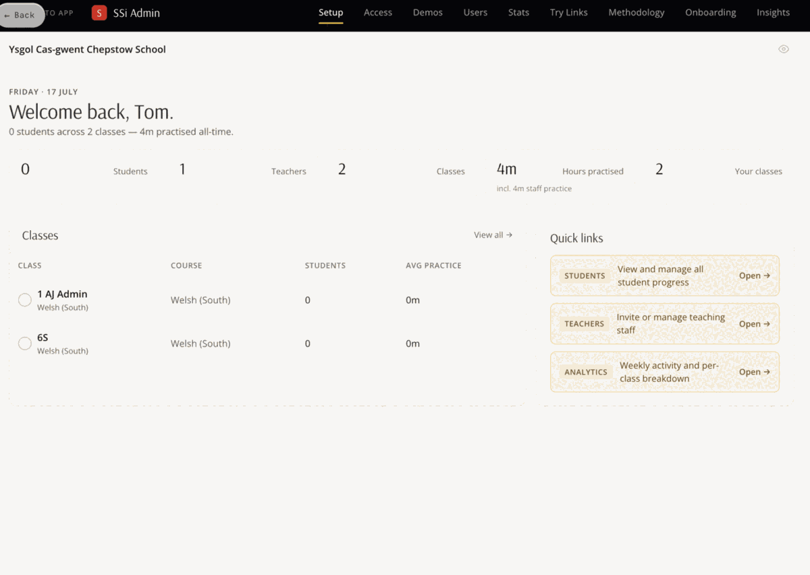 | 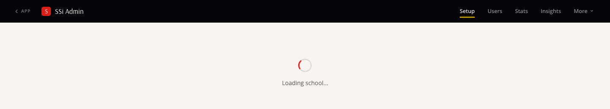 |
| Admin, desktop 1440 | 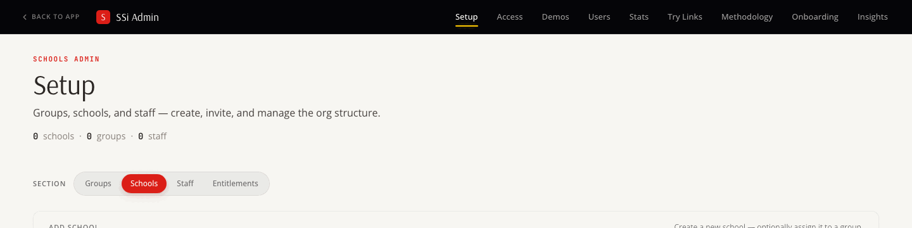 | 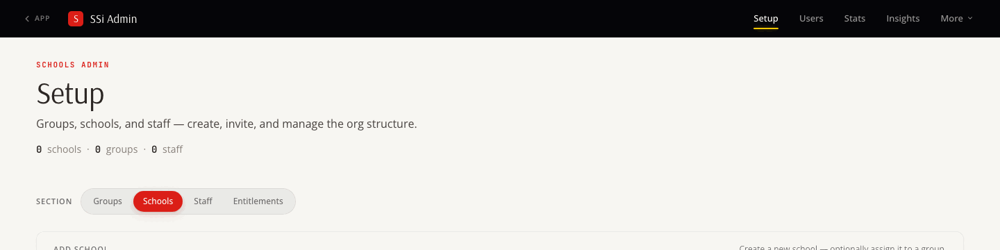 |
| Admin, 768 | 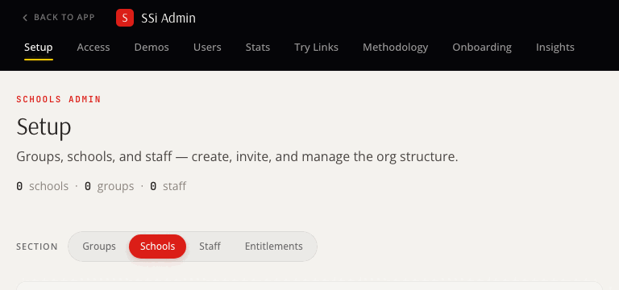 | 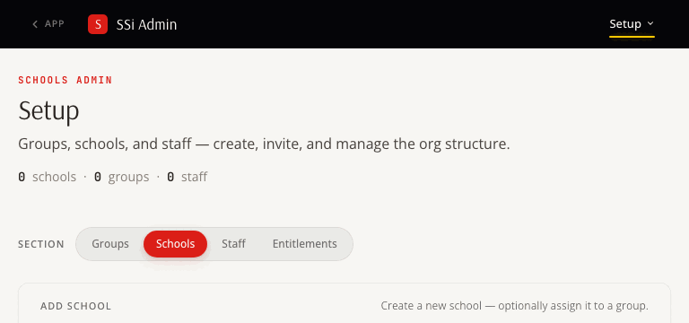 |
| Admin, 390 | 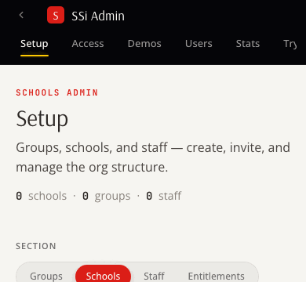 | 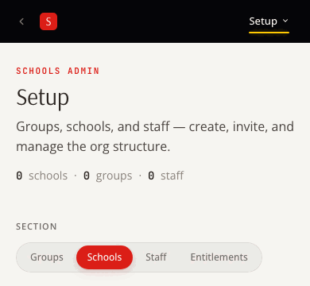 |
| Admin "More" menu open | — | 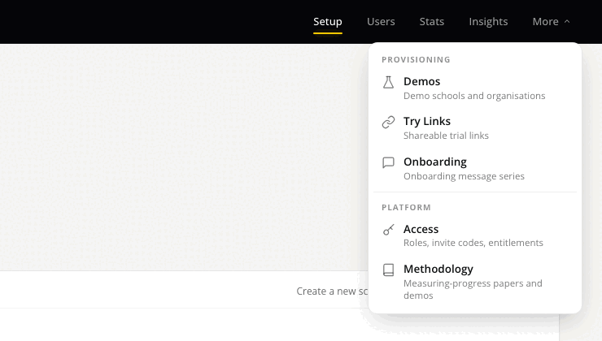 |
| Admin collapsed menu open (768) | — | 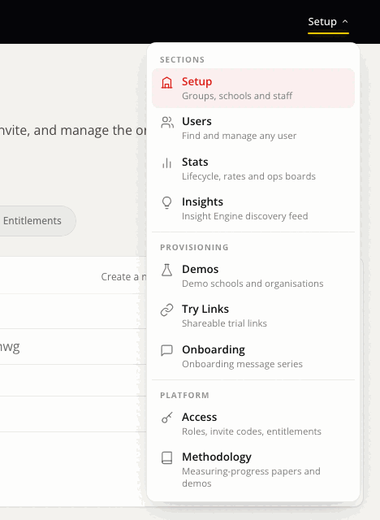 |
| Schools (school_admin), desktop | 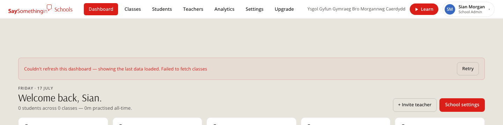 | 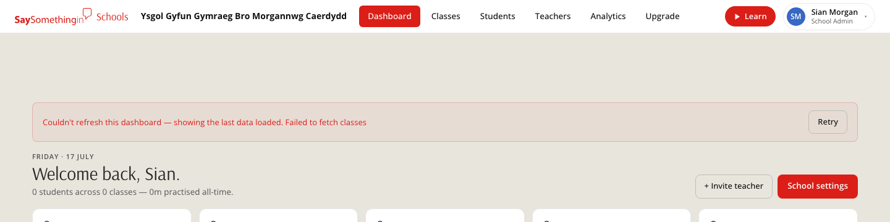 |
| Schools (school_admin), 768 | 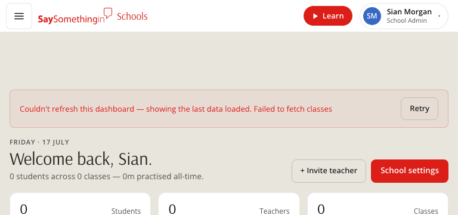 |  |
| Schools (school_admin), 390 | 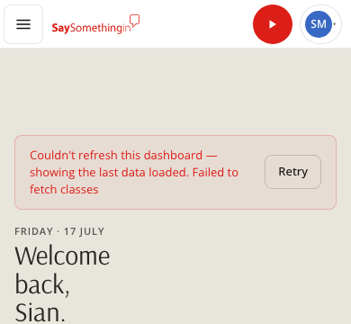 | 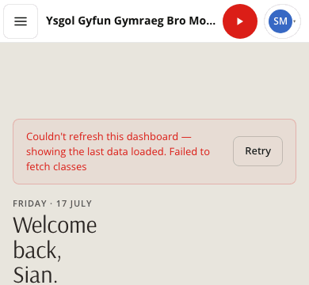 |
| Schools drawer open, 390 | — | 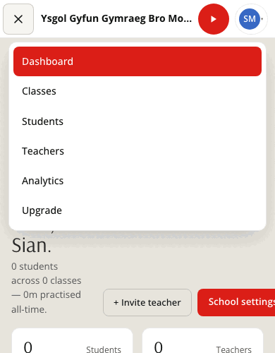 |
| Schools (teacher), desktop | 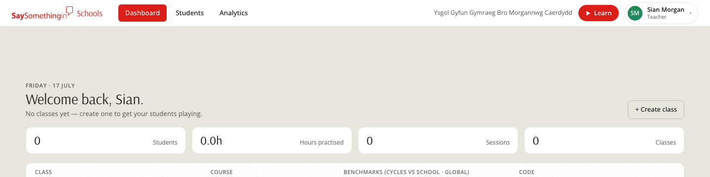 | 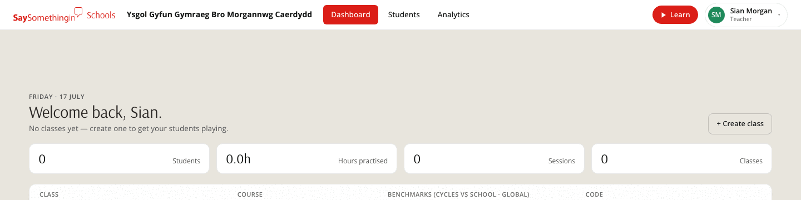 |
| Schools (teacher), 390 | 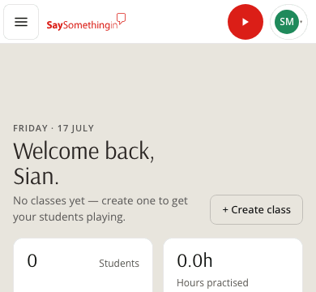 | 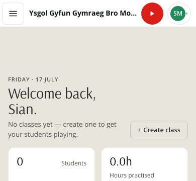 |

(The "after" read-view shot shows the loading state — captured without live
school data — but proves the pill is gone and the bar is one clean row; the
identity bar itself is visible on the deployed dev build.)

Tests: `AdminTopBar.test.ts` (grouping, active-in-More, collapsed trigger
names current section), `e2e/mobile-topbar/topbar-layout.spec.ts` (school
name visible + no overlaps + tap-target floors at 320/375/430px).
