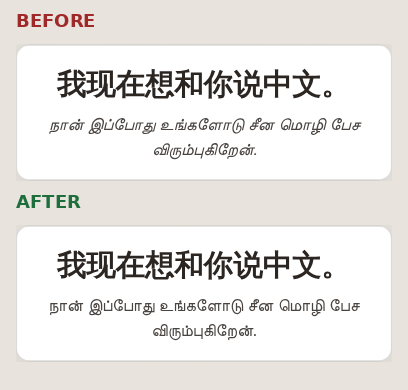
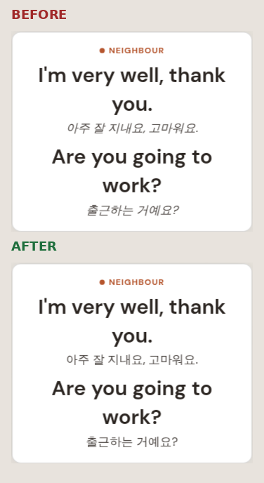
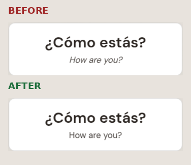

# No more synthetic italic on non-Latin scripts

Fixed, live on **dev** and **staging**. The recording tools are fixed too, on Popty `main`.

## What was wrong

The known-side line under the target phrase was set in italic. Tamil has no italic — nor does
Han, Hangul, Devanagari, Arabic, Hebrew or Thai — so the browser was not choosing a second
typeface. It was **shearing the upright letters sideways** and calling the result italic. That is
a transform, not a typeface, and on letterforms built from vertical stems and loops it reads as a
rendering fault.

## The card you saw — `zho_for_tam`

## Korean, same defect

## Spanish for English — the Latin control

The italic is gone here too, deliberately. The gloss still reads as the gloss, through weight and
colour, and the app now has one visual language rather than a different one per script.

## The measurement, not just the picture

Read off the live page at the moment of each shot:

| Course | Line | Before | After |
|---|---|---|---|
| zho_for_tam | Tamil known | `font-style: italic`, weight 400 | `font-style: normal`, weight 400 |
| eng_for_kor | Korean known | `font-style: italic`, weight 400 | `font-style: normal`, weight 400 |
| spa_for_eng | English known | `font-style: italic`, weight 400 | `font-style: normal`, weight 400 |

The target line is weight 600 in every case — that difference, plus the colour step, is what now
separates the two lines.

## How it is done — no list of course codes

Two parts.

1. **The known-side gloss drops italic everywhere** and separates from the target by **weight**
   (400 against 600) and **colour**, which work in every script. Applied identically in Latin.
   Surfaces changed: the Immersion/Drill card, the teleprompter, the recording screen, and the
   listening nudge line in the player.

2. **A guard so it cannot come back.** Text in a language whose script has no italic renders
   upright whatever any component asks for. The trigger is the **script of the language on the
   line**, derived from one table that maps every language in the estate — both sides of all 149
   live courses plus all 22 interface locales — to its script. Latin, Greek and Cyrillic keep
   italic; they have real drawn italics.

A test holds the table and the CSS to each other, and **fails if a new course arrives in an
unclassified script** — so this cannot quietly return through a language nobody thought about.

## Where it is

- Learning app: `dev` and `staging` — verified live on staging, screenshots above are dev.
- Recording tools (Popty): `main` — the autocue translation line, the recordist's source segment,
  and the seed-known line in Listening Config. All three were already told apart by colour; the
  italic was only adding the shear.

**Not merged to `main` on the learning app** — that is your call.

---

Reproduce: `packages/player-vue/e2e/noitalic-card-probe.mjs` drives the card and reads
`getComputedStyle().fontStyle` off the live page.

    export LD_LIBRARY_PATH=/home/tomcassidy/.pwlibs/root/usr/lib/x86_64-linux-gnu:/home/tomcassidy/.ssi-sentinel-libs
    export CHROME_BIN=/home/tomcassidy/.cache/ms-playwright/chromium-1234/chrome-linux64/chrome
    BASE_URL=https://staging.saysomethingin.app OUT_DIR=/some/dir/ node e2e/noitalic-card-probe.mjs

Phone-readable copy of this page, images inline: https://watson-1.tail4968cb.ts.net/d/fad75a48
