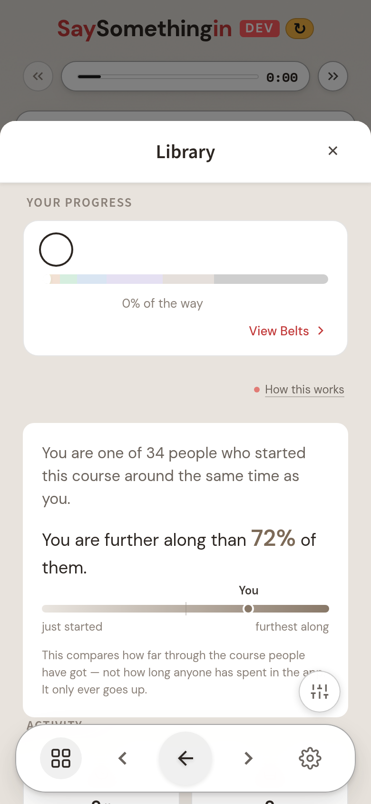
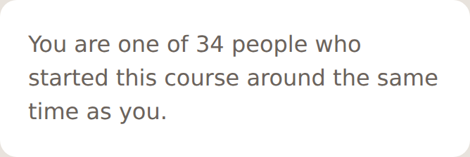
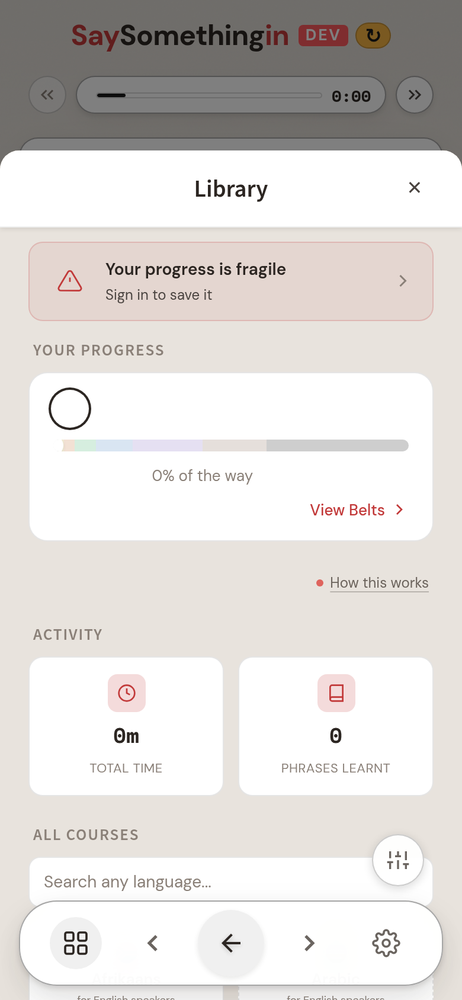

# Relative standing — the one comparison the doctrine allows

**Live on staging** · `staging.saysomethingin.app` · branch `staging` at `64276f87` · 2026-08-31

You asked whether we could improve the gamification "without sacrificing our gamification done
right perspective — i.e. placing people in the top X% type thing". Short version: **yes, and it is
built and on staging — but on today's data it correctly shows nothing to anybody, and the reason
why is the most useful thing in this document.**

---

## 1. The doctrine, in the estate's own words

It is written down twice, and the two say opposite-looking things until you read them together.

`docs/methodology/insight-engine.md` §3.5 — the standing widget, specified:

> The signature Lens-A widget is **standing** — a sovereign-comparison variant that *celebrates the
> most-engaged*. For a chosen window it shows the **top 5, anonymised**, the individual's own
> marker, the average, and the percentile — *"you're in the top 20% of Welsh learners."* It exists
> to honour the handful really putting the time in and to let everyone feel part of it — **never a
> league table to climb**.

`docs/gamification-done-right.md` — why most of it is banned:

> | **Leaderboards** | Comparison anxiety; competition over growth |
> | **Progress bars** | "Not there yet" framing instead of "look how far" |

**Standing survives where badges and streaks do not because it is information about where you are,
not a prize for showing up.** That is the whole argument, and it is the one you were pointing at.

## 2. But you deleted the percentile four weeks ago

This is the thing you most need to know, and I have not smoothed it over.
`apml/design/learner-profile.apml`, your design session of **2026-08-03**:

> `top_5_leaderboard: "DELETED — comparison is not the instrument"`
> `percentile: "DELETED"`

Your ask today re-opens exactly that. It is a genuine reversal of your own ruling, not a reading of
it, and I have recorded it in the APML as a reversal (`ruling PercentileReopened`) rather than
quietly reconciling it away.

The surviving half of your 2026-08-03 reason — *numbers exist ONLY as descriptive insights a
learner could count themselves, never a reward* — I have treated as still binding, and it shaped
every choice below. **The top-5 list stays deleted. I did not build it.**

---

## 3. What I built

A panel in the Library, above Activity. Two sentences and a strip:



And below the halfway mark, this — the collective line, and nothing else:



That second state is a change I made after photographing the first one. The panel already
suppressed the percentage below the halfway mark, on the grounds that "further along than 12% of
people" is a shortfall dressed as a statistic. But the **strip** was still being drawn, with the
marker over on the left — which states the same shortfall graphically, and more viscerally than
the number would have. Suppressing the figure while drawing the picture was a fig leaf, so below
the mark the panel now keeps the collective line and nothing else. It is about belonging rather
than rank, which is the half of the standing widget that is meant to be for everybody.

Three properties keep it on the right side of the doctrine, and all three are enforced by test, not
by good intentions:

**It ranks progress, never time.** The metric is `highest_completed_lego_id` — how far through the
course you have actually got. Grinding cannot move it; only learning can. This is the direct answer
to "never rewarding grinding over understanding": sitting in the app for six hours changes this
number by exactly nothing.

**It cannot express absence.** That field is a *high-water mark*, monotonic by construction, so a
learner's own value can never fall. There is no window and no decay. This matters more than it
sounds: a percentile over a rolling 30 days would be **a streak wearing a percentile's clothes** —
it would drop while you were away, which hands the system the ability to say "you have slipped".
That is the shame email your own `/me` acceptance test exists to make impossible. This one cannot
say it, because the arithmetic has no way to.

**It only ever counts who you are ahead of.** The payload carries `aheadOfPct` — never a rank,
never a "behind N%". Mathematically the same fact; psychologically the opposite one. And below the
halfway mark the percentage is dropped entirely and only the collective line remains, because "you
are further along than 8% of people" is a shortfall dressed as a statistic.

## 4. The cohort — and why most percentiles are a lie

You flagged this yourself and you were right. Two filters stand between the raw table and any
number a learner sees.

**Who counts.** Only real individual humans. The `learners` table already carries the flags and
somebody has kept them properly maintained. Measured on the live database today:

| | rows |
|---|---|
| `learners` total | 1,136 |
| `is_demo` | 723 |
| `is_class_entity` | 76 |
| `is_internal` | 19 |
| testers + ssi_admins | 17 |
| **real individuals left** | **346** |
| …of whom have ever reached a position in a course | **88**, across **53** courses |

Note the class entities: **"Grade 6A", "Blwyddyn 5", "Year 7 Blue" are rows in the `learners`
table.** They are classes, not people. Any percentile that forgot to exclude them would be ranking
children against their own form group as though it were a person.

**Against whom.** The tightest cohort that clears the floor wins, and the ladder is deliberately
only two rungs long:

1. same course **and** same enrolment quarter — people who started the same thing at the same time
2. same course, any start time
3. **nothing.** It never pools across courses, because a Welsh learner's position against a
   Japanese learner's is not a true statement, and pooling to manufacture a cohort is precisely the
   lie the gate exists to prevent.

The floor is **k ≥ 20**. Below that a single person moves the figure by more than 5%, and the
number stops describing a population and starts describing a handful of individuals.

## 5. What that means today: it shows nothing, and that is correct

I ran the **shipped functions against the live database**. This is the real code, not a model of it:

```
SHIPPED FLOOR = k>=20
eligible enrolments (real individuals with a position): 272, distinct learners 88

floor k>=20: placed   0  refused 272  of which shown a percentage 0
floor k>=10: placed  84  refused 188  of which shown a percentage 31
floor k>= 5: placed 216  refused  56  of which shown a percentage 76
```

And this is the Library on staging as a learner sees it today — the panel correctly absent between
"How this works" and "Activity", the rest of the screen untouched:



**At the shipped floor, nobody gets a number. Zero out of 272.** The largest genuine single-course
cohort is 19 people (Afrikaans). The arithmetic demonstrably works — drop the floor and it produces
sensible placements immediately — but the honest population is not there yet.

This is your own standing ruling, and I am following it rather than working around it
(`WORKLIST.md`, 2026-07-14):

> **ANALYTICS ARE REAL OR ABSENT.** … comparison/benchmark views only make sense once real cohorts
> exist — wire them real but don't fake them meanwhile; **empty-with-honesty beats seeded.**

The panel lights up on its own, with no further work, the day a real cohort clears 20 — which the
schools pipeline will produce. And there is a quiet bonus in this: **the reversal in §2 currently
costs nothing.** No real learner can see a percentile, so you can taste the thing and re-rule it
before it ever reaches anybody.

## 6. What I would not do, and why

- **A full leaderboard or a ranked list.** Comparison anxiety, and it makes the goal beating people
  rather than speaking the language. Your 2026-08-03 deletion of the top-5 stands; I did not
  re-open it.
- **A percentile on time, minutes, or sessions.** This is the one that would earn engagement at the
  cost of the learning — it rewards sitting in the app over getting anywhere, and it is gameable by
  anyone who works out what it measures.
- **A percentile over a rolling window.** A streak in disguise. It falls while you are away, so the
  system gains the ability to notice absence — the one capability the whole `/me` design is built
  to deny it.
- **"Top X% of all learners ever."** Meaningless, and cruel by accident: it compares a week-one
  beginner with a five-year veteran and puts every new learner in the bottom few percent on their
  first day.
- **Named or initialled peers, at any cohort size.** At 20-30 people initials identify a real
  person — and in a school, a classmate.
- **Any notification or email about standing.** Ever. That is the delivery mechanism of every
  mechanic this doctrine exists to refuse.

## 7. Two calls that are yours, not mine

1. **The reversal itself.** You deleted the percentile on 2026-08-03 saying "comparison is not the
   instrument". I have built it because you asked today, and flagged it because you may not have
   had that ruling in mind. If it still stands, say so and I will pull the panel — it is one
   import and one line in `BrowseScreen.vue`.
2. **The floor.** k ≥ 20 is my judgement, deliberately a constant in the code rather than a tunable
   knob, because lowering it is a decision about what we are willing to assert. At k ≥ 10 the
   feature would go live for 84 enrolments tomorrow. I would not — 10 people is a bad population to
   be a percentage of — but it is a taste call and it is yours.

---

**Built:** `api/me/standing.ts` · `packages/player-vue/src/components/me/StandingPanel.vue` ·
wired in `BrowseScreen.vue` · `apml/design/learner-profile.apml` updated.
**Tests:** 28 API + 10 component, covering the k-floor, the eligibility filter, the two-rung cohort
ladder, and the two things the panel must never render.
**Gates:** core build · player-vue typecheck · api typecheck · api 1,484 tests · player-vue 2,674
tests · lint 0 errors.
