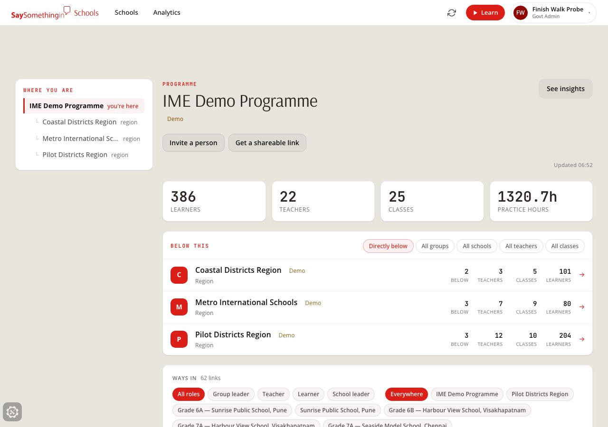
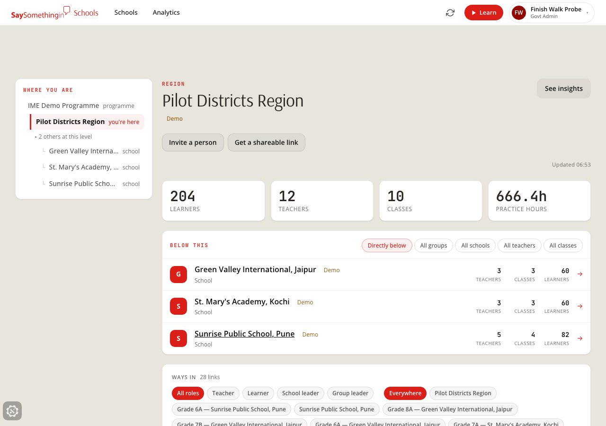
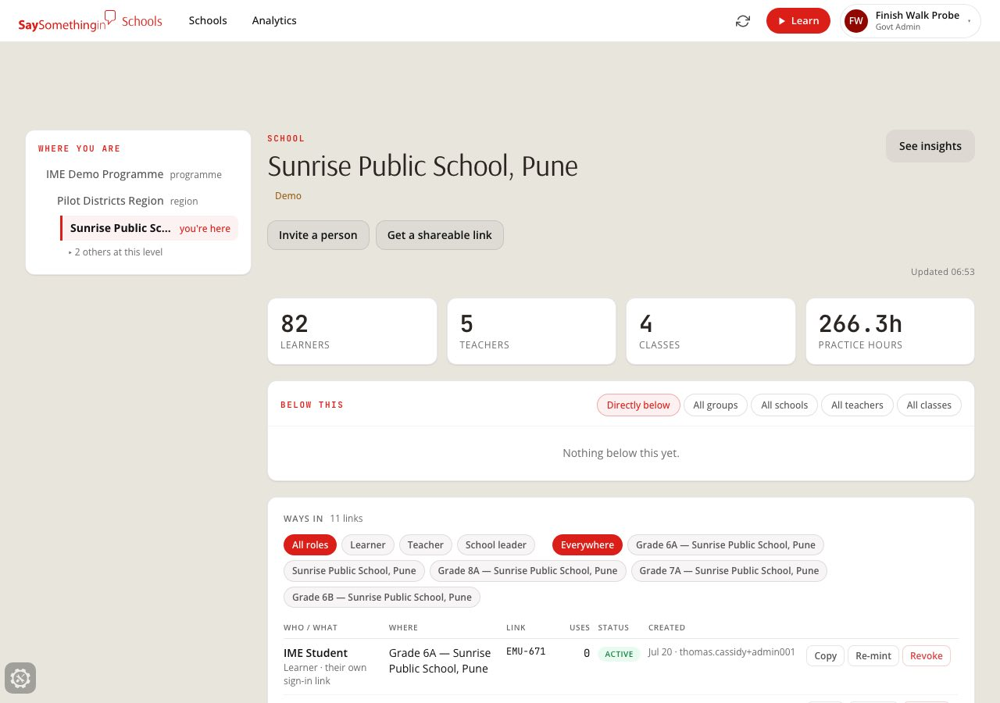
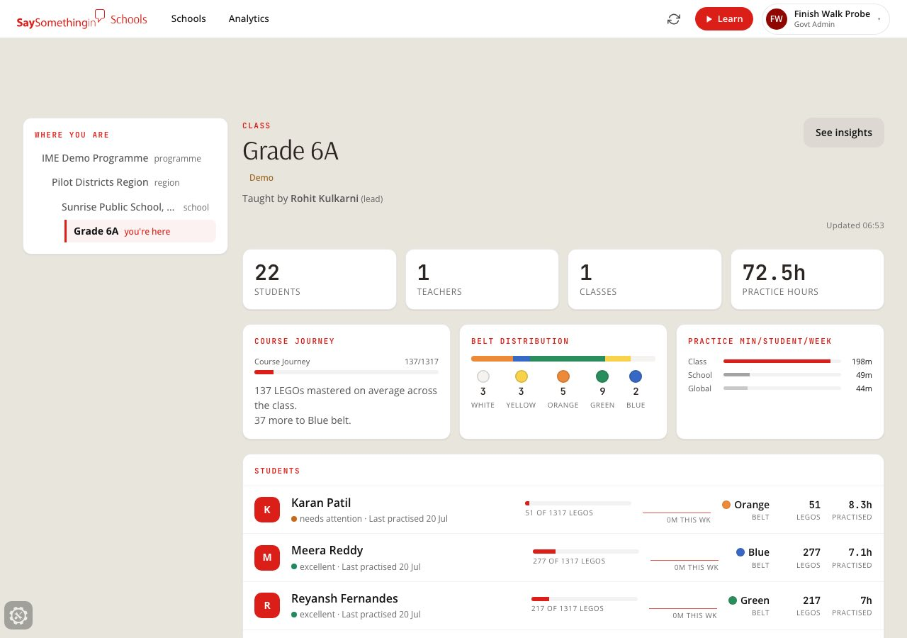
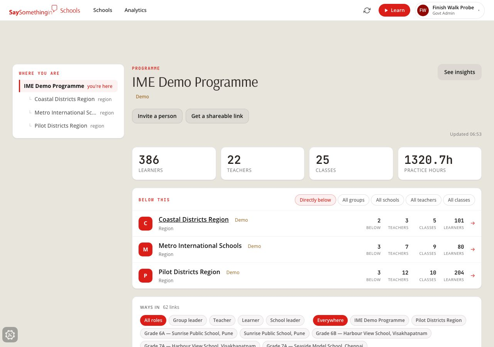
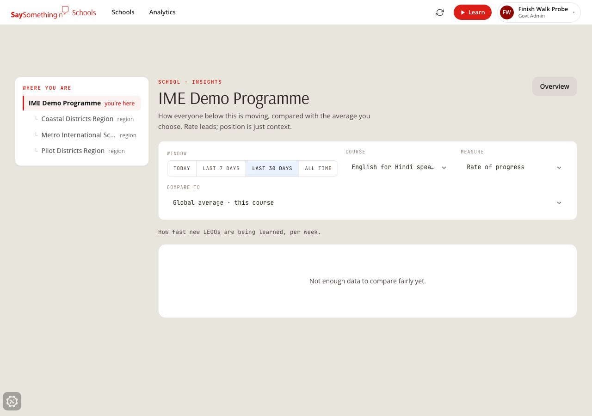
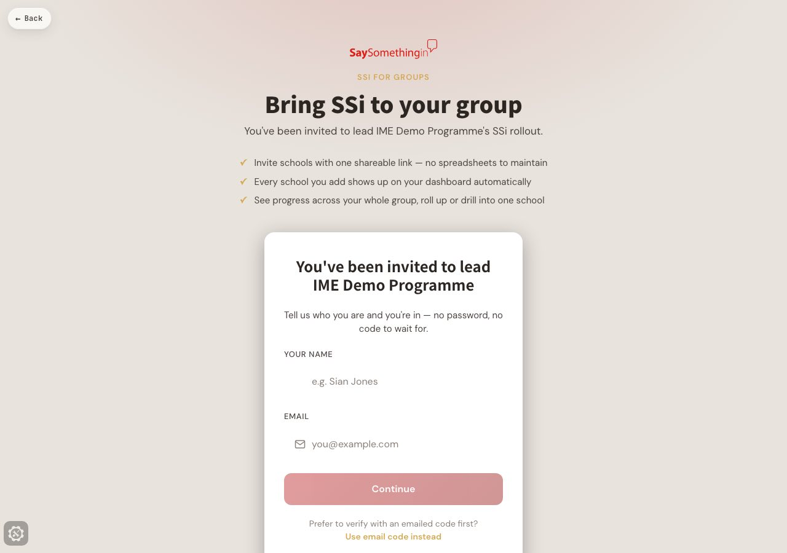
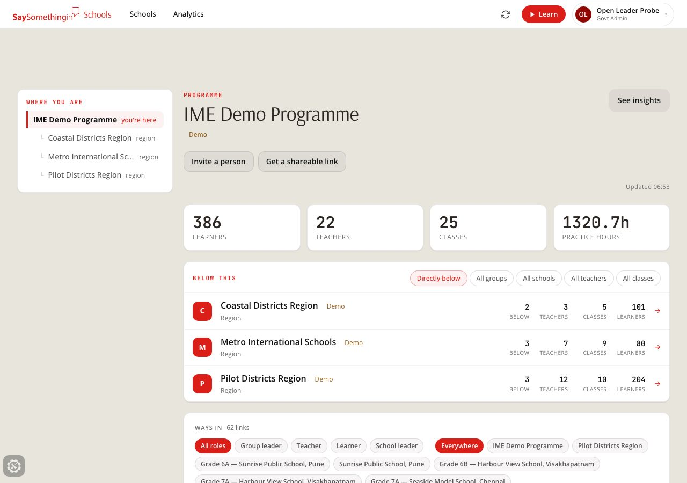
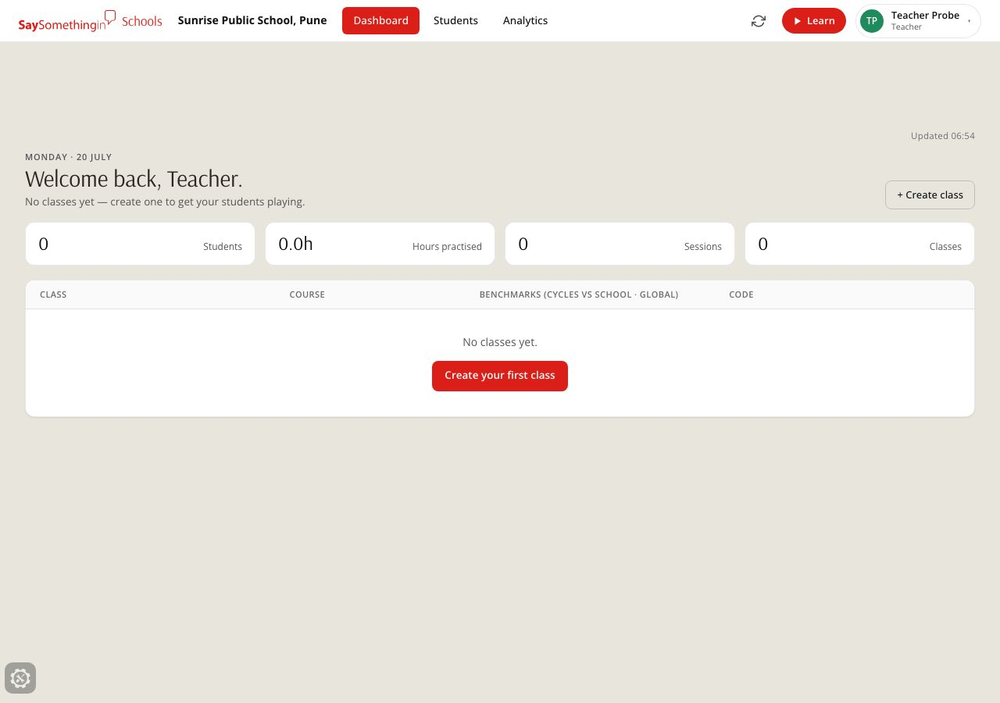
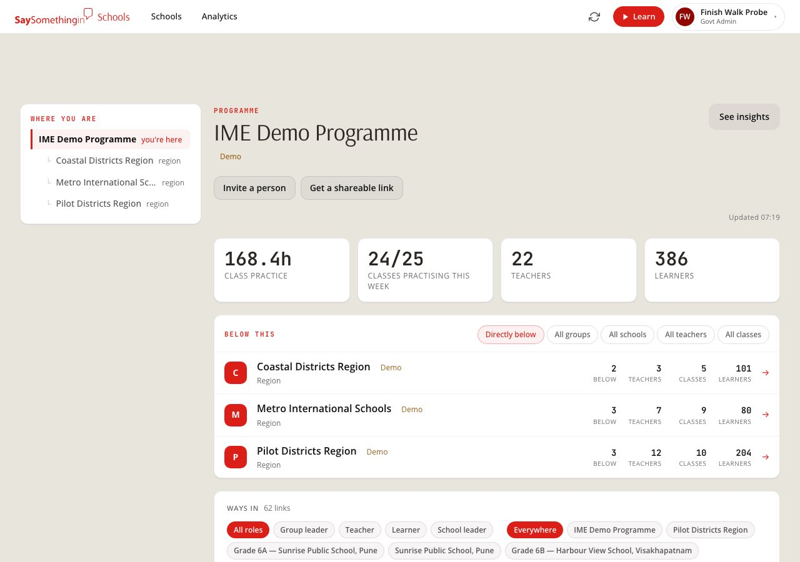

# Leader surface — deployed walk (2026-07-20)

Finishing walk of the member mount (`075aaf83`, leaders land on THE VIEW at
`/schools/org/:id`) on the **deployed dev build** (`version.json` = `075aaf8`),
then promoted dev → staging → main. Scripts:
`packages/player-vue/e2e/the-view/member-mount-verify.mjs` (landing grammar,
desktop + phone) and `e2e/the-view/leader-walk-finish.mjs` (deep drill, admin
refusal, open code, teacher regression). All probe accounts and codes were
minted fresh and deleted after each leg.

## What a partner leader now experiences

1. **Personal link → zero screens.** A fresh personal group-leader link on the
   IME Demo Programme (`/group/XWT-598` pattern) opened in a clean incognito
   context lands STRAIGHT on their node home — no capture, no OTP, no
   interstitial. Rail ("WHERE YOU ARE") rooted at their programme, identity
   header with demo badge, four stat cards (learners · teachers · classes ·
   practice hours), children list with lens chips, See insights, WAYS IN
   ledger, and only the invite verbs (Invite a person · Get a shareable link).
   
2. **Drill their subtree, never leaving it.** Programme → Pilot Districts
   Region → Sunrise Public School, Pune → Grade 6A, every step staying on
   `/schools/org/…`, the rail keeping full ancestry with you-are-here moving.
   Class home carries the full teaching density: Course journey, Belt
   distribution, practice-min/student/week, flat student rows (belt · LEGOs ·
   hours · last practised · needs-attention).
   
   
   
3. **No admin escape.** "All organisations" appears nowhere; a direct visit to
   `/admin/structure` renders nothing (deny-not-defer gate) and bounces the
   leader back to their own node home within ~5s.
   
4. **Insights keep the map.** `/schools/org/:id/insights` opens scoped to the
   node, Overview back-verb present, no All-boards admin lens.
   
5. **Open leader code (capture species).** A shareable `/group/:code` link
   shows exactly ONE screen — "Tell us who you are and you're in" (name +
   email, no password, no OTP) — then lands on the same node home.
   
   
6. **Teachers unharmed.** An open teacher link minted on Sunrise Public School
   redeems through the same capture screen and lands on the teacher `/schools`
   surface — not the org mount, no org rail.
   

## Results

- Deployed dev walk: **member-mount-verify** 28/28 PASS (desktop + phone) after
  fixing the script's drill to match the programme→region→school tree;
  **leader-walk-finish** 27/27 PASS (one flake fixed in the script: the admin
  bounce is waited-for, not raced with a fixed 7s sleep). Zero page errors on
  every leg.
- Dev moved under the walk (`f646ab50`, LANE B class-practice payload landed
  mid-session) — the full suite was re-run green against the `f646ab5` build
  before promoting, so the promoted tip is exactly what was verified. One
  false alarm en route: repeated probe redemptions tripped the redemption
  rate limit ("Too many attempts") — a limiter working as designed, not a
  build defect; the suite passed once it cooled.
- **Promoted dev → staging** (`153914af`, merge of dev `8ce525fb`):
  staging.saysomethingin.app served `153914a`; member-mount 28/28, finish
  walk all legs, player smoke (home 4.8s, start control, 4 audio plays,
  zero errors) — ALL GREEN.
- **Promoted staging → main** (`153914af` fast-forward):
  saysomethingin.app served `153914a`; player smoke ALL GREEN (first hit
  21.9s cold edge, warm re-run 4.5s), member-mount 28/28 ALL GREEN, finish
  walk ALL GREEN — the personal zero-screen landing, subtree drill, admin
  refusal, open capture code and teacher link all verified **on production**.
  

*Last updated: 2026-07-20*
